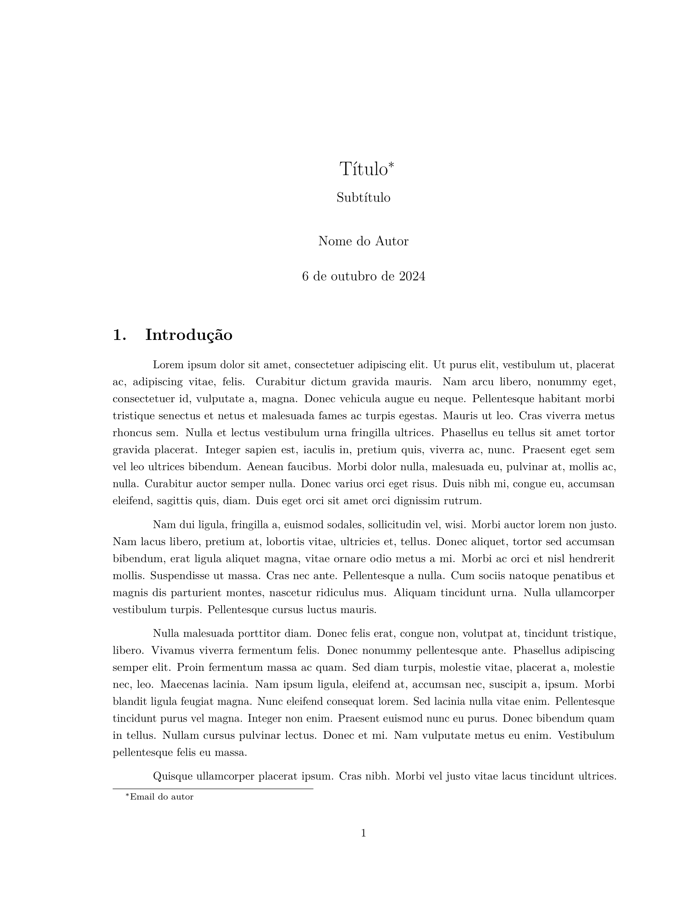

# Conteúdo

* [Overview](#overview)
* [Utilização](#utilização)
  * [Conversão de ficheiros](#conversão-de-ficheiros)
* [Template](#template)

--- 

## Overview

Este repositório serve como bakcup do meu template para notas em Markdown. 
A razão principal para tirar notas em Markdown é, simplesmente, porque é muito mais fácil de escrever do que `LaTeX`. Quando eu quero tirar notas de alguma coisa, quero que seja um processo fácil e rápido e com Markdown isso é possível pois a `syntax` é bastante simples.

Após ter as notas escritas em Markdown, utilizo o `pandoc` para o converter para `pdf`, produzindo dessa forma um documento com uma formatação profissional, sem muito esforço.

> *Este template foi feito para ser utilizado com a minha configuração de `neovim`, que pode ser instalada [aqui](https://github.com/joaopintosp/neovim-config)*.

## Utilização

É necessário instalar uma distribuição `LaTeX` para converter os ficheiros `.md` em `.pdf`. Em sistemas Linux (Ubuntu) pode-se instalar a distribuição `texlive` com o seguinte comando.
```bash
sudo apt install texlive-full
```

É necessário instalar o `pandoc`, para isso executa-se o seguinte comando.
```bash
sudo apt install pandoc
```

### Conversão de ficheiros

Para converter um ficheiro `main.md` em `main.pdf` basta executar o seguinte comando, dentro do diretório do ficheiro `main.md`.
```bash
pandoc -s -f markdown main.md -t pdf -o main.pdf --filter pandoc-crossref
```

O argumento `--filter pandoc-crossref` é um *filtro do pandoc*. Um *filtro do pandoc* é uma forma de extender o `pandoc` de forma a que ele execute *macros* que o permite, neste caso, referenciar secções, equações, figuras, etc.
Para mais informações relativamente ao *pandoc-crossref*, ver este [link](https://github.com/lierdakil/pandoc-crossref).

## Template


